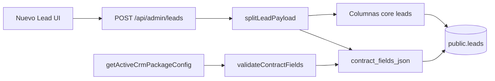

# Diseño Persistencia Campos Dinámicos Pickup 12W-5d — Constructor CRM Summer87

**Versión:** 12W-5d — decisión y diseño de persistencia configurable para campos de contrato (Pickup piloto)  
**Proyecto:** summer87-leads-v3  
**Base documental:**

| Documento | Commit / rol |
|-----------|----------------|
| `diseno-nuevo-lead-pickup-fields-12W-5a.md` | Diseño campos, bloques A–E, opciones §6 (`3e7e354`) |
| `validacion-ui-nuevo-lead-pickup-fields-12W-5b.md` | Validación técnica UI |
| `validacion-vercel-nuevo-lead-pickup-ui-12W-5b-QA.md` | QA Vercel GO visual (`20fa832`) |
| `diseno-mapping-nuevo-lead-pickup-payload-12W-5c.md` | Mapping mínimo, NO-GO notas/columnas Pickup (`db9a736`) |
| `plan-contrato-constructor-crm-operativo-12V.md` | Contrato operativo; JSONB postergado 12X+ |
| `auditoria-brecha-constructor-vs-crm-operativo-pickup4x4-12U.md` | Brecha schema compartido vs `lead_fields` |
| `lib/crmPackage/configs/pickup4x4.config.ts` | Contrato demo Pickup |
| `lib/crmPackage/adapters/leadFields.ts` | `packageToLeadFields()` |

**Estado:** **solo documentación** — sin implementación, SQL, migraciones, API ni datos.

---

## 1. Resumen ejecutivo

- **12W-5b** dejó el bloque **Vehículo** como sección visual en `client_crm`: marca, modelo, año, matrícula y uso aparecen como tarjetas informativas, sin inputs ni envío al POST (`cb5c910`). QA Vercel confirmó **GO** visual y **NO-GO** persistencia (`20fa832`).
- **12W-5c** cerró el **mapping mínimo** contrato → payload actual: **10** claves contrato + `contacto` legacy persisten hoy; **13** claves quedan fuera (vehículo, presupuesto, tipo/estado cliente, accesorios estructurados, Kore). Dictamen: **GO** mapping documentado; **NO-GO** columnas Pickup, **NO-GO** volcar extras en `notas`/`oferta`.
- **12W-5d** (esta fase) define **cómo** persistir campos dinámicos gobernados por `lead_fields` del paquete CRM, empezando por Pickup, **sin romper** la visión de fábrica de CRMs (un esquema por instancia, N contratos por claves, no N migraciones por cliente).
- **Recomendación principal:** columna **JSONB única** en `public.leads` (nombre propuesto: `contract_fields_json`), con convención de claves = claves del contrato, validación en API contra `packageToLeadFields()`, y **capa de mapeo** que separa campos **core** (columnas existentes) de campos **extension** (JSONB). **EAV** (`lead_field_values`) queda como **fase posterior** (12X+ / paquetes instalables maduros), no para el piloto Pickup.
- **En 12W-5d no se ejecuta SQL.** Este documento cierra la decisión de producto/arquitectura; el DDL sigue el **mismo protocolo que 12W-4c** (`SCHEMA-1` → `SQL-1` → `SQL-2-EXEC` → implementación app).
- **Próximo paso recomendado (orden):**
  1. **12W-5d-SCHEMA-1** — inspección read-only de `public.leads` (columnas, tipos, índices, RLS si aplica, usos JSONB existentes: `objetivos`, `audiencia`, `installation_details_json`, `commercial_strategy_json`, …).
  2. **12W-5d-SQL-1** — diseño DDL `contract_fields_json` + PRECHECK/POSTCHECK + rollback (sin ejecución).
  3. **12W-5d-SQL-2** — ejecución manual del DDL en Supabase **solo si Daniel aprueba** (registro `…-SQL-2-EXEC`).
  4. **12W-5e** — API POST/GET + UI editable bloque Vehículo (y extensiones JSONB); **asume columna ya creada** tras SQL-2; **sin migración DDL**.
  5. **12W-5-QA** — POST Vercel con vehículo persistido; Ficha/Kanban.

---

## 2. Estado actual (post 5b y 5c)

### 2.1 UI Nuevo Lead

**Archivo:** `app/admin/leads/nuevo/page.tsx`

| Aspecto | Estado |
|---------|--------|
| Modo Pickup | `useLeadsClientCrmMode()` → bloques A–E |
| Bloque Vehículo | Solo `client_crm`; copy de fase futura; sin `useState` de vehículo |
| Payload `LeadCreatePayload` | 16 campos fijos; sin claves de contrato dinámicas |
| Snapshot contrato | `data-crm-package-lead-fields-*` vía `useLeadFieldsConfig()`; no render dinámico aún |

### 2.2 API POST

**Archivo:** `app/api/admin/leads/route.ts`

- `LeadCreateInput` acepta columnas legacy + Casa Limpia (`installation_details_json`, `rubro_id`, …) pero **no** un blob de campos de contrato.
- `insert` persiste solo lo tipado en `Partial<LeadRow>`; vehículo y extensiones Pickup **no entran**.
- `cleanActivityType` restringe `next_activity_type` a `ALLOWED_ACTIVITY` (desalineación con `activity_types` del contrato documentada en 12W-5c).

### 2.3 Contrato y adapter

**`pickup4x4.config.ts`:** 4 grupos, 25 claves en `lead_fields.groups[]`.  
**`packageToLeadFields()`:** normaliza grupos y `allFields`; `source: "contract"`. El contrato **no** define `type`, `required`, ni catálogos de valores (solo nombres de campo).

### 2.4 Tabla `leads` hoy (relevante)

Columnas ya usadas para Pickup vía mapping 5c:

`nombre`, `contacto`, `telefono`, `email`, `origen`, `pipeline`, `oferta`, `notas`, `next_activity_type`, `next_activity_at`, `comercial_id`, `direccion`.

Precedentes JSONB en la misma tabla (otros verticales):

| Columna | Uso histórico | Lección para 5d |
|---------|---------------|-----------------|
| `objetivos`, `audiencia` | jsonb genérico (consultivo) | Patrón aceptado en instancia; tipado laxo en API |
| `installation_details_json` | Casa Limpia — detalle instalación | **Paralelo vertical:** JSONB por dominio, no columnas por campo |
| `commercial_strategy_json` | Estrategia comercial IA | JSONB para estructuras variables sin migrar por clave |

Columnas **facility** (`superficie_m2`, `cantidad_personal`, `rubro_id`, …) siguen en schema compartido; en Pickup se **ocultan** en UI pero demuestran el anti-patrón que 5d evita: schema monolítico + ocultamiento ≠ fábrica CRM.

---

## 3. Campos Pickup a persistir (alcance 5d)

### 3.1 Clasificación por destino de persistencia

| Clave contrato | Grupo | Destino recomendado 5d | Notas |
|----------------|-------|------------------------|-------|
| `nombre` | Cliente | Columna `nombre` | Ya core |
| `telefono` | Cliente | Columna `telefono` | Ya core |
| `email` | Cliente | Columna `email` | Ya core |
| `origen` | Cliente | Columna `origen` | Ya core; catálogo futuro en metadata contrato |
| `contacto` | — | Columna `contacto` | Legacy útil; fuera contrato |
| `localidad` | Cliente | **JSONB** | No mezclar con `direccion` sin decisión explícita (5c D4) |
| `tipo_cliente` | Cliente | **JSONB** | |
| `estado_comercial` | Cliente | **JSONB** | Distinto de `pipeline` / etapa Kanban |
| `marca` | Vehículo | **JSONB** | Núcleo piloto |
| `modelo` | Vehículo | **JSONB** | |
| `año` | Vehículo | **JSONB** | number en JSON |
| `matricula` | Vehículo | **JSONB** | |
| `tipo_uso` | Vehículo | **JSONB** | |
| `accesorios_interes` | Vehículo | **JSONB** | No concatenar en `oferta` (5c NO-GO) |
| `producto_servicio` | Oportunidad | Columna `oferta` | Ya core |
| `presupuesto_estimado` | Oportunidad | **JSONB** | number o string normalizado |
| `vendedor_responsable` | Oportunidad | Columna `comercial_id` | UUID |
| `etapa` | Oportunidad | Columna `pipeline` | Nombre BD, no `stage_key` |
| `proxima_accion` | Oportunidad | Columna `next_activity_type` | Adapter contrato → API (5c) |
| `fecha_limite` | Oportunidad | Columna `next_activity_at` | ISO |
| `observaciones` | Oportunidad | Columna `notas` | Ya core |
| `kore_*` | Kore | **JSONB** sub-objeto o omitir en create | Solo lectura / sync futura |

### 3.2 Resumen contable (objetivo 5e)

| Destino | Cantidad aprox. |
|---------|-----------------|
| Columnas core (sin cambio de modelo) | 11 (+ `contacto`) |
| JSONB `contract_fields_json` | 12 claves Pickup en piloto |
| Kore en create | 0 escritura hasta integración |

### 3.3 Futuros clientes (fuera Pickup, misma mecánica)

Cualquier paquete instalable que declare `lead_fields.groups[]` con claves distintas (ej. inmobiliaria, servicios B2B) escribe en el **mismo** JSONB con las **mismas** reglas: solo claves listadas en el contrato activo de la instancia; columnas core siguen siendo el subconjunto estable Summer87 (nombre, pipeline, comercial, …).

---

## 4. Comparativa de opciones de persistencia

| ID | Opción | Pros | Contras | Riesgo | Veredicto 5d |
|----|--------|------|---------|--------|--------------|
| **A** | Solo UI; POST actual (estado 5b) | Cero migración | Vehículo no guardado; deuda UX | Medio producto | **Estado actual** — superado por necesidad de piloto |
| **B** | Extras en `notas` / `oferta` estructurado | Sin DDL | No reportable; migración frágil; UX engañosa | **Alto** | **NO-GO** (5a, 5c, 5b-QA) |
| **C** | **JSONB** en `leads` (`contract_fields_json`) | Una migración; multi-cliente; alineado 12V/12U; queries Postgres `->>`; coincide con `installation_details_json` | Índices/reportes requieren diseño; validación API obligatoria | Medio técnico | **GO recomendado** piloto + fábrica |
| **D** | Columnas `marca`, `modelo`, … Pickup | SQL simple por campo | N clientes = N ALTER TABLE; rompe fábrica | **Alto** mantenimiento | **NO-GO** |
| **E** | **EAV** `lead_field_values(lead_id, field_key, value_*)` | Máxima normalización; catálogos por tipo | Joins; UI genérica compleja; overhead instalador | Alto | **Postergar** 12X+ |

### 4.1 JSONB vs EAV — criterios de decisión

| Criterio | JSONB (`contract_fields_json`) | EAV |
|----------|--------------------------------|-----|
| Time-to-value piloto Pickup | **Alta** — un ALTER + API | Baja — tablas, índices, capa query |
| Alineación con contrato actual (lista de claves) | **Directa** — objeto clave→valor | Requiere materializar filas por clave |
| Reportes «por marca» en piloto | `WHERE contract_fields_json->>'marca' = $1` + índice GIN opcional | `JOIN` + pivot o agregación |
| Validación en create/update | Whitelist `allFields` del adapter | Whitelist + tipo por fila |
| Compatibilidad instancias legacy | `{}` por defecto; core intacto | Filas vacías = mismo efecto |
| Evolución a paquetes instalables DB | Compatible con `active_crm_package_configs` (12X) | Natural si hay millones de filas heterogéneas |
| Complejidad equipo actual | Baja — patrón ya usado (`installation_details_json`) | Media-alta |

**Dictamen:** para Summer87 Leads v3 y piloto Pickup, **JSONB gana**. Reevaluar EAV cuando: (1) exista UI genérica de formulario driven-by-metadata en contrato; (2) reporting exija tipado fuerte por columna SQL sin JSON; (3) volumen y auditoría por campo obliguen historial fila a fila.

---

## 5. Diseño recomendado — JSONB `contract_fields_json`

### 5.1 DDL propuesto (borrador para 12W-5d-SQL-1; ejecutar solo en 12W-5d-SQL-2)

El script siguiente es **referencia de diseño** para el documento SQL-1. **No ejecutar** en 12W-5d ni en 12W-5e. La ejecución manual corresponde a **12W-5d-SQL-2** tras SCHEMA-1 + aprobación.

```sql
-- 12W-5d-SQL-2 — NO ejecutar en 12W-5d ni documentar como ejecutado hasta aprobación Daniel
ALTER TABLE public.leads
  ADD COLUMN IF NOT EXISTS contract_fields_json jsonb NOT NULL DEFAULT '{}'::jsonb;

COMMENT ON COLUMN public.leads.contract_fields_json IS
  'Valores de campos declarados en lead_fields del paquete CRM activo (claves = field keys del contrato).';

-- Opcional piloto reportes por marca (Pickup):
CREATE INDEX IF NOT EXISTS idx_leads_contract_fields_marca
  ON public.leads ((contract_fields_json->>'marca'))
  WHERE (contract_fields_json ? 'marca');
```

**Por qué un solo JSONB y no reutilizar `installation_details_json`:** semántica distinta (instalación facility vs campos de contrato CRM); evita mezclar verticales en un blob opaco. **Por qué no `objetivos`/`audiencia`:** reservados al flujo consultivo; mezclar Pickup generaría deuda de migración y reportes.

### 5.2 Forma del documento JSON

**Principio:** claves planas en la raíz del objeto = claves del contrato (`marca`, `localidad`, …). Sin anidar por grupo en v1 (el grupo es metadata UI del adapter, no del storage).

**Ejemplo Pickup al crear lead:**

```json
{
  "marca": "Toyota",
  "modelo": "Hilux",
  "año": 2022,
  "matricula": "SAB1234",
  "tipo_uso": "trabajo",
  "accesorios_interes": ["tapa rígida", "baca"],
  "localidad": "Montevideo",
  "tipo_cliente": "particular",
  "estado_comercial": "calificado",
  "presupuesto_estimado": 45000
}
```

**Metadata de versión (opcional v1.1, recomendado en 5e):**

```json
{
  "_meta": {
    "contract_id": "pickup4x4-2026-05-19-0001",
    "schema_version": "1.0.0",
    "updated_at": "2026-05-21T12:00:00.000Z"
  },
  "marca": "Toyota"
}
```

Regla: claves con prefijo `_` reservadas al sistema; la API **no** acepta `_meta` desde el cliente en create — la rellena el servidor desde `getActiveCrmPackageConfig()`.

### 5.3 Reglas de validación (API 5e)

| Regla | Comportamiento |
|-------|----------------|
| Whitelist | Solo claves ∈ `packageToLeadFields(config).allFields` menos las mapeadas a columnas core |
| Core no duplicado | Si la clave tiene columna dedicada (`nombre`, `oferta`, …), el valor va a la columna; si también viene en body `contract_fields`, **gana la columna** y se ignora la clave en JSONB (o 400 — elegir una política en 5e-IMPL; recomendación: **strip** silencioso + log) |
| Tipos v1 | string \| number \| boolean \| string[]; sin objetos anidados salvo arrays de strings |
| Kore en POST create | **Rechazar** escritura de `kore_*` desde Nuevo Lead hasta integración |
| Tamaño | Límite ej. 16 KB serializado; 400 si excede |
| Sanitización | `trim` strings; `año` y `presupuesto_estimado` como number finito |
| Vacío | Omitir clave o `null` → no almacenar clave (compactar JSON) |

**Campos excluidos del JSONB porque son core (mapping 5c):**

`nombre`, `telefono`, `email`, `origen`, `producto_servicio`→`oferta`, `vendedor_responsable`→`comercial_id`, `etapa`→`pipeline`, `proxima_accion`→`next_activity_type`, `fecha_limite`→`next_activity_at`, `observaciones`→`notas`.

### 5.4 Índices y reportes

| Necesidad Pickup | Enfoque 5e / 5f |
|------------------|-----------------|
| Listado Kanban sin filtro por marca | Sin índice extra |
| Reporte «consultas por origen» | Columna `origen` (ya core) |
| Reporte «por marca» / «vehículo identificado» | Índice expresión en `marca` o vista materializada 12W-6 |
| Presupuesto agregado | Cast `(contract_fields_json->>'presupuesto_estimado')::numeric` con validación |

Catálogo `reports.catalog` del contrato ya declara keys como `consultas_por_origen`; los que requieran JSONB deben documentar **query contract** en fase de reportes (12W-6), no en 5d.

---

## 6. Diseño alternativo — EAV (referencia, no piloto)

### 6.1 Esquema conceptual

```sql
-- Referencia documental — NO-GO piloto 5d
CREATE TABLE public.lead_field_definitions (
  id uuid PRIMARY KEY DEFAULT gen_random_uuid(),
  contract_id text NOT NULL,
  field_key text NOT NULL,
  value_type text NOT NULL CHECK (value_type IN ('text','number','boolean','date','json')),
  group_label text,
  UNIQUE (contract_id, field_key)
);

CREATE TABLE public.lead_field_values (
  lead_id uuid NOT NULL REFERENCES public.leads(id) ON DELETE CASCADE,
  field_key text NOT NULL,
  value_text text,
  value_number numeric,
  value_boolean boolean,
  value_json jsonb,
  updated_at timestamptz NOT NULL DEFAULT now(),
  PRIMARY KEY (lead_id, field_key)
);
```

### 6.2 Cuándo migrar de JSONB a EAV (o convivir)

- Historial auditable por campo (quién cambió `marca` y cuándo).
- Form builder en Constructor que **materializa** definiciones en BD al activar paquete.
- Reporting BI que exige star schema sin funciones JSON.
- >50 claves heterogéneas por lead con tipos fuertes.

**Transición posible:** exportar `contract_fields_json` → filas `lead_field_values` en migración 12X; mantener JSONB como caché denormalizado (dual-write) solo si el rendimiento lo exige.

---

## 7. Capa API y contrato — POST / GET

### 7.1 Shape POST propuesto (12W-5e)

**Precondición:** columna `contract_fields_json` existente en BD (POSTCHECK de **12W-5d-SQL-2-EXEC**). Sin ella, 5e no debe desplegarse.

Ampliación **backward compatible** de `POST /api/admin/leads`:

```typescript
// Documental — no implementado en 5d
type LeadCreateBody = LeadCreateInput & {
  contract_fields?: Record<string, unknown>;
};
```

**Flujo servidor:**



**Funciones nuevas (ubicación sugerida):** `lib/crmPackage/adapters/leadFieldPersistence.ts`

| Función | Responsabilidad |
|---------|-----------------|
| `splitLeadPayload(body, adapterConfig)` | Separa core vs extension |
| `validateContractFields(values, adapterConfig, options)` | Whitelist + tipos |
| `mergeContractFieldsForRead(row, adapterConfig)` | Expone objeto plano en GET para Ficha/Nuevo |

### 7.2 GET lista y detalle

- Incluir `contract_fields_json` en `SELECT_WITH_SNAPSHOT` (o alias `contract_fields` en respuesta API).
- **Ficha lead** (`GET /api/admin/leads/[id]`): merge para renderizar bloque Vehículo y campos Cliente/Oportunidad no core.
- **Kanban:** opcionalmente mostrar badge «marca» si existe clave — producto 5f.

### 7.3 Relación contrato → persistencia (precedencia)

| Capa | Fuente de verdad | Rol |
|------|------------------|-----|
| Definición de campos (qué existe) | `CrmPackageConfig.lead_fields` → adapter | Whitelist |
| Labels y grupos UI | Contrato + mapa metadata futuro (`pickupFieldMeta`) | Presentación |
| Valores guardados | Columnas core + `contract_fields_json` | Persistencia |
| Pipeline / etapas | `leads_pipelines` materializado (12W-4) | Operativo |
| Permisos | RBAC DB | No en JSONB |

El Constructor **no** escribe en `leads` al aprobar paquete; solo define qué claves son válidas. La activación de paquete (12X) puede sincronizar `lead_field_definitions` si más adelante se adopta EAV.

### 7.4 Adapter de actividades y campos dinámicos

Persistencia JSONB **no sustituye** el adapter `activity_types` → `ALLOWED_ACTIVITY` (12W-5c). Son ortogonales:

- `proxima_accion` sigue en columna `next_activity_type` con adapter.
- Ampliar `ALLOWED_ACTIVITY` con `visita_showroom`, `instalacion` es cambio de API separado (ticket 5d-D3 o 5e).

---

## 8. UI Nuevo Lead y Ficha (diseño 5e, no código 5d)

**Precondición:** misma que §7.1 — DDL aplicado en SQL-2; 5e es solo aplicación (UI + API), no schema.

| Pantalla | Cambio previsto |
|----------|-----------------|
| Nuevo Lead bloque B | Inputs controlados; states `marca`, `modelo`, …; incluir en `contract_fields` del POST |
| Copy bloque B | Reemplazar «fase posterior» por validación normal; quitar banner amber si persiste |
| Bloque C | Campo `accesorios_interes` (tags o textarea) → JSONB, no `oferta` |
| Bloque E | `localidad` dedicado → JSONB; `direccion` sigue columna |
| Ficha lead | Sección Vehículo lectura/edición según permisos |
| Formulario dinámico total | **NO** en 5e — solo claves Pickup cableadas o generadas desde `leadFields.groups` con metadata mínima hardcodeada en adapter |

**Render driven-by-contract completo** (tipos, required, selects de catálogo) = fase **12W-5f** o ampliación del schema Zod del contrato (12V-2+).

---

## 9. Migración de datos y legacy

| Escenario | Acción |
|-----------|--------|
| Leads existentes demo | `contract_fields_json = '{}'` por default |
| Intentos previos de volcar vehículo en `notas` | **No** parsear automáticamente; si existieran, script manual 12N |
| Columnas facility en leads Pickup | Dejar NULL; no borrar columnas en 5e |
| `oferta` con texto mixto producto+accesorios | No migrar; nuevo alta separa `accesorios_interes` en JSONB |
| Instancias sin `CRM_PACKAGE_CONFIG_ENABLED` | POST ignora `contract_fields`; columna queda `{}` |

---

## 10. Fases siguientes

### 10.1 Cadena obligatoria post-5d (protocolo SQL alineado a 12W-4c)

| Orden | Fase | Alcance | SQL ejecutado | Entregable |
|-------|------|---------|---------------|------------|
| 0 | **12W-5d** (esta) | Decisión JSONB vs EAV; convención claves; diseño API (documental) | **No** | Este documento |
| 1 | **12W-5d-SCHEMA-1** | Inspección read-only `public.leads`: columnas, tipos, defaults, índices, constraints, políticas RLS, columnas JSONB existentes y volumen de filas demo | **No** (solo SELECT) | `…-SCHEMA-1-RESULTS.md` |
| 2 | **12W-5d-SQL-1** | Diseño DDL `contract_fields_json` + PRECHECK/POSTCHECK + rollback + checklist backup (11Q) | **No** | `…-SQL-1.md` (referencia: `diseno-ddl-stage-key-leads-pipelines-12W-4c-SQL-2.md`) |
| 3 | **12W-5d-SQL-2** | Ejecución manual DDL en Supabase SQL Editor **si Daniel aprueba** | **Sí** (manual) | `…-SQL-2-EXEC.md` |
| 4 | **12W-5e** | API POST/GET + `leadFieldPersistence` + UI editable bloque B/C/E | **No** — asume columna tras SQL-2 | PR + doc validación |
| 5 | **12W-5-QA** | POST Vercel: lead con vehículo; Ficha/Kanban | No | Doc QA |

**Antes de cualquier DDL** debe existir SCHEMA-1 con estado real confirmado (evitar suposiciones sobre JSONB legacy o índices en `leads`).

### 10.2 Fases paralelas u opcionales

| Fase | Alcance | SQL | Notas |
|------|---------|-----|-------|
| **12W-5c-IMPL** | Labels + adapter actividades | No | Paralelizable; no sustituye SCHEMA-1/SQL-1 |
| **12W-5f** | Metadata campo en contrato; formulario más genérico | No | Post-5e |
| **12W-6** | Reportes que lean JSONB; índice expresión `marca` si producto lo pide | Opcional en SQL-1 o ALTER posterior | Tras datos reales en demo |
| **12X** | `active_crm_package_configs`; posible EAV | Sí | Infra paquetes instalables |

---

## 11. NO-GO explícitos (12W-5d y cadena SCHEMA/SQL hasta 5e)

- No ejecutar SQL ni migraciones en **12W-5d** (solo diseño de decisión).
- No ejecutar DDL sin **12W-5d-SCHEMA-1** previo ni sin documento **12W-5d-SQL-1** aprobado.
- No incluir migración DDL en **12W-5e** — el DDL vive en **12W-5d-SQL-2** (manual Supabase).
- No desplegar código 5e que escriba `contract_fields_json` si SQL-2-EXEC no está aplicado en el entorno.
- No columnas `marca`, `modelo`, `matricula`, … específicas Pickup.
- No guardar vehículo ni presupuesto en `notas` u `oferta` (parche silencioso).
- No reutilizar `installation_details_json` para campos de contrato Pickup.
- No escribir `kore_*` desde Nuevo Lead sin integración.
- No enviar `stage_key` en POST en lugar de `pipeline` (nombre).
- No romper `LeadCreatePayload` existente: `contract_fields` es **opcional** y additive.
- No formulario multi-tenant en un despliegue (fuera de alcance 12V).
- No commit ni cambio de código en la fase 5d.

---

## 12. Riesgos

| Riesgo | Impacto | Mitigación |
|--------|---------|------------|
| Usuario asumió persistencia en 5b | Frustración al guardar | SCHEMA-1 → SQL-2 → 5e UI + QA POST |
| DDL sin inspección previa | Conflicto con JSONB/índices existentes | Obligar **12W-5d-SCHEMA-1** antes de SQL-1 |
| Claves libres en JSONB | Basura, inyección de claves | Whitelist adapter + strip |
| Reportes sin diseño | JSONB guardado pero no visible en hub | 12W-6 + índice `marca` |
| Divergencia contrato vs BD pipeline | Labels distintos | Ya documentado 5c D8; no bloquea JSONB |
| Tipado laxo (`año` string vs number) | Ordenación incorrecta | Validación API + normalización |
| Segunda fuente de verdad | Core vs JSONB duplicado | Tabla §5.3 «core no duplicado» |
| EAV prematuro | Complejidad sin piloto | Postergar 12X |
| Regresión Casa Limpia | POST ampliado toca route compartido | `contract_fields` opcional; tests smoke legacy |

---

## 13. Dictamen final

| Pregunta | Dictamen |
|----------|----------|
| ¿Persistir campos dinámicos Pickup en piloto? | **GO** — con JSONB |
| ¿JSONB vs EAV en piloto? | **JSONB** (`contract_fields_json`) |
| ¿EAV en piloto? | **NO-GO** — postergar 12X+ |
| ¿Columnas Pickup dedicadas? | **NO-GO** |
| ¿Parche en `notas`/`oferta`? | **NO-GO** |
| ¿Mantener core en columnas existentes? | **GO** — mapping 5c intacto |
| ¿SQL en 12W-5d? | **NO-GO** — solo diseño de decisión |
| ¿Próximo paso inmediato? | **12W-5d-SCHEMA-1** — inspección read-only `public.leads` |
| ¿Después de SCHEMA-1? | **12W-5d-SQL-1** → aprobación → **12W-5d-SQL-2** → **12W-5e** (API/UI, sin DDL) |

**Criterio de éxito del piloto (post SQL-2-EXEC + 5e + QA):** columna `contract_fields_json` presente en BD; crear lead Pickup con marca/modelo/año/matrícula/uso persistidos; abrir Ficha y ver mismos valores; Kanban sin regresión; instancia legacy sin contrato sigue creando leads con `{}` en JSONB.

---

## 14. Confirmación de alcance

| Ítem | Valor |
|------|-------|
| Código modificado | **No** |
| API modificada | **No** |
| SQL ejecutado | **No** |
| Supabase modificado | **No** |
| Datos modificados | **No** |
| Solo documentación | **Sí** |
| Commit | **No** (por instrucción de fase) |

---

## 15. Referencias de código y docs

| Archivo / doc | Uso en 5d |
|---------------|-----------|
| `app/admin/leads/nuevo/page.tsx` | Payload actual; bloque Vehículo informativo |
| `app/api/admin/leads/route.ts` | POST insert; SELECT; sin JSONB contrato hoy |
| `lib/crmPackage/configs/pickup4x4.config.ts` | 25 claves `lead_fields` |
| `lib/crmPackage/adapters/leadFields.ts` | Whitelist futura |
| `diseno-nuevo-lead-pickup-fields-12W-5a.md` | Opción C preferida §6 |
| `diseno-mapping-nuevo-lead-pickup-payload-12W-5c.md` | 13 pendientes; NO-GO notas |
| `validacion-vercel-nuevo-lead-pickup-ui-12W-5b-QA.md` | GO visual; vehículo no persistente |
| `plan-contrato-constructor-crm-operativo-12V.md` | JSONB postergado 12X — diseño 5d; DDL SCHEMA/SQL; app en 5e |
| `auditoria-brecha-constructor-vs-crm-operativo-pickup4x4-12U.md` | Schema compartido → JSONB gobernado por contrato |
| `diseno-ddl-stage-key-leads-pipelines-12W-4c-SQL-2.md` | Protocolo SCHEMA-1 → SQL-1 → SQL-2-EXEC (referencia de proceso) |

---

*Documento generado en fase 12W-5d. Próximo paso: 12W-5d-SCHEMA-1. DDL: 12W-5d-SQL-1 / SQL-2. API/UI: 12W-5e (sin DDL).*
